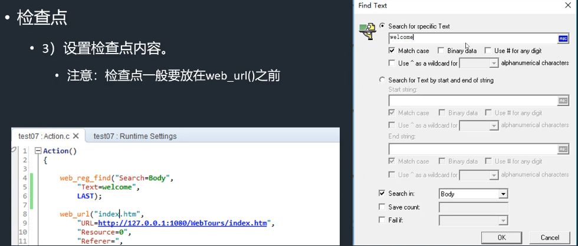

# LoadRunner笔记

## 基本使用总结

注：由于LR11版本较老，兼容性很差（win10及现有版本浏览器）

​        最好使用win7浏览器加ie8/9或低版本其他浏览器（firefox 24等）

​        新版LR12社区版并发数有限，最高50

​        建议使用LR12社区版录制脚本，在LR11破解运行脚本。

### 步骤

1.打开Loadrunner主程序，选择create script =》new script =》web（http/html）

2.在VUG 里面  点start record  ，选择相应浏览器，输入测试网站URL

3.录制脚本，添加事务，集合点（可以之后编辑脚本时加上）

4.完成录制，编辑脚本（删除不必要内容，添加事务，集合点等），运行脚本，确认脚本是否能正常运行

5.创建场景（tools => create controller..........  选择虚拟用户数和保存目录，非必须）

6.在controller下方Global Schedule  设置用户数，持续时间，用户进出设置，如何运行脚本

7.运行脚本期间可以观察脚本运行情况等，结束后在Results=》Analysisi results进入Analysis

8.在analysis中能够看到自动生成的报告，通过表格和图表进行数据分析以评估网站性能

## tips

### 1

Hits per Second==HTTP requests per Second： 每秒虚拟用户HTTP请求（服务器）数

Total Throughput (bytes)所统计数量是，在整个测试过程中，从服务器返回给客户端的所有字节数，与发送请求的字节数无关！

系统的吞吐能力 TPS（Transaction Per Second, 每秒事务数）

### 注：如何获取VU和TPS

- #### VU 获取方式：                         					                        

  已有系统：可选取高峰时刻，在一定时间内使用系统的人数，这些人数可认为是在线用户数，并发用户数可以取10%，例如在半个小时内，使用系统的用户数为10万，那么取10%（即1万）作为并发用户数基本就够了。

  新系统：没有历史数据作参考，建议通过业务部门进行评估。

- #### TPS 获取方式：                         					                        

  已有系统：可选取高峰时刻，在一定时间内（如3~10分钟），获取系统总业务量，计算单位时间（秒）内完成的笔数，乘以2-5倍作为峰值的 TPS，例如峰值3分钟内处理订单18万笔，平均TPS是1000，峰值TPS可以是2000-5000。

  新系统：没有历史数据作参考，建议通过业务部门进行评估。


## 学习笔记

### 常见函数


## VuGen脚本增强


脚本强化手段：

1.事务和集合点

   事务：局部操作汇总，是TPS（每秒钟事务数）衡量基础

   集合点：虚拟用户集合在一起，实现并发操作

2.参数化和检查点

​    检查点（断言）

3.Runtime setting（运行时设置）

### 一.事务和集合点

#### 事务：

性能测试中，除了要衡量整个脚本的性能外，还需要脚本中某一段或几段操作的性能，以便更详细的知道具体是用户的哪些动作对系统性能的影响比较大;
LoadRunner采用在脚本中定义事务来达到这一要求。事务就是在脚本中定义的某段操作，更确切的说，就是一段脚本语句。

事务可以嵌套，可以更加详细的统计事务

##### 事务开始/结束标记

```
1r_start_transaction("事务名字");
//运行代码
1r_end_transaction("同一个事务名字",LR_AUTO);
```

#### 集合点 Rendezvous（实现真正意义上的并发）

一般的并发过程仅仅体现在开始执行的一刹那，随着服务器对请求的响应时间的不一致或系统环境条件的限制，用户的执行速度将不一致，在运行过程中能够集合到一点的可能性很小，这样并不是真正意义的并发。

系统压力最大的情况是:所有用户都集合到系统瓶颈的某个点上进行操作。

从脚本的角度讲，这个点就是执行脚本的某一条或一段语句，为了真实模拟这种情况，LoadRunner提供集合点的功能，实现真正意义上的并发。

注意:

1.集合点只能放在action中，而不能放在vuser_ init ()和vuser_ end ()中;
**2.集合点应该放在事务之前;** 

```
lr_rendezvous("bf_open");
```

集合点设置


超时是从第一个开始等开始，到时间全部放行

### 二.1检查点（断言）

检查点
检查点的功能主要验证某个界面上是否存在指定的Text对象
               目的主要是检查压力较大时Web服务器能否返回正常的页面
Load runner提供的检查点:

```
//文本检查点: 
//深入了解: reg是注册的童思，要在网页请求之前就进行检查点的注册，检查点   函数一般放在页面请求之前
web_reg_find()
//注：LR默认编码方式不支持中文、
//检查点需要开启（下图）才能使用
```


(f4 打开设置)


(insert里面)



一般是选择一些文本作为标志

### 二.2参数化

使用变量代替脚本中的常量，使得虚拟用户能够真实模拟现实用户进行系统操作

操作：

1.选中右键即可进行相应设置

2.f4 里面**设置循环次数**来检验脚本正确性（iteration count）

1)使用变量代替脚本中的常量，是的虚拟用户能够真实的模拟现实用户进行系统的操作。
2)在脚本中选择被参数化的数据，
3)创建参数列表
4)设计和添加参数的测试数据
5)设置参数化的运行方式(模拟和预览效果)
6)在运行时设置中，设置运行次数(Run logic) , 对指定的脚本
7)设置脚本运行日志(log) 为扩展日志(extend log)， 显示脚本运行的参数


### 三.脚本运行时设置（Runtime-Setting）

#### 1、General (基本设置)

##### 1）Run logic:

运行流程(循环)。主要作用用于设计脚本的循环运行次数。ini和end脚本文件都只运行一次。
其他脚本文件，可以设置运行多次(一起运行多次,不能单独设置)

##### 2）Pacing: 间隔。

(特指脚本运行时上一次迭代和后一次迭代之间的时间间隔)
①尽快开始迭代，在上一次结束之后
②指定迭代之间的延迟:可以是固定的时间(秒)，也可是两个时间间隔的随机值(上一迭代完成后)
③新的迭代在指定的或者随机的时间(秒)之后，直接开始。(不管上一次迭代有没有完成)

##### 3）Log

日志。提供测试人员(运行人员查看脚本的运行过程)。
①标准日志:标准格式
②日志功能只有开启之后，才能使用。
③日志内容设置，可以设置为当脚本运行错误的时候,而不需要总是显示日志。
④扩展日志:增加日志显示的内容(包括:参数的使用情况，服务器的返回数据)

##### 4）Think Time

①忽略思考时间。脚本回放可以忽略。实际场景中，一般不会忽略。
②按照录制的思考时间进行回放。
③倍数运行思考时间。
④**随机取值录制的思考时间的中间比例**（常用）
⑤限制思考时间在固定的几秒。(不和①- 起使用)超过指定数值的，按照指定数值运行:不超过的按照实际数值运行。

##### 5) Miscellaneous

error handling:
①脚本运行错误情况下，继续进行脚本的运行(一般都选择的。)

②通常和①一起勾选

③不常用（尤其是12）

multithreading：（性能差3-4倍）

测试：30个vuser

进程：每一个进程大概6.5m内存

线程：一个进程一共56m

#### 2、Internet Protocol (网络协议的设置)

##### 1) Preferences: 表现

设置检查点的开启。(enable image and text checks)选择后，可以进行检
查点的功能，用于web_ reg_ find()函数进行检查点功能。


## Controller场景设计

### 一、基础及简介

#### 1、启动:

1)使用VuGEN中Tools-- ->Create Contoller Scenario。只是针对当前脚本进行场景的创建。所有资源只有当前脚本可用
2)使用Corntoller的独立程序 (桌面图标)启动。
①可以选择场景类型
②可以选择脚本的数量
总结:没有根本上的区别，后期设计界面均可以再调整。(一样的)

#### 2、两种场景

1) 手工场景:手工设置虑拟用户量。加压、减压、持续时间和其他内容。
2) 目标导向型场景:根据设定的目标进行运行。只要设计好目标，其他的用户量、时间、并发等等
都不需要单独设置。
3) 选择运行的脚本-L oadrunner的脚本。
总结:手工的场票适用场合比较广泛，灵活，可以设置并发(集合点)以及其他设置。通过测试可以了解系统的多方位的性能指标。
目标导向的场景适用场合比较少。不灵活,不能设置并发和其他操作。只是针对特定目标的一种测试。


#### 3.面向目标的场景设计（不常用）

1)启动onrtrller, 选择场景类型为: Goal-Ortented Scenario。
2)选择测试脚本，放到场景中。
3)设计测试场景的目标，[edit Scenario Goal]
①可以设计目标的名称(new. edlt. del)
②定义目标。
首先，选择场景目标的类型。(虚拟用户量、 每秒钟点击数、每秒钟事务数.事务响应时间、每分钟页面数)，一共就5个目标，单一性体现在这
其次设计目标数量值。
最后设置具体可用的虚拟用户量。
所有设置都是根据目标的变化而具体设定，不是固定不变的。
③设置运行时间。可以设置为目标达成后运行的时间。
④目标没有达到的选择。(要么继续运行直到目标完成， 要么停止运行)
⑤设置是否需要改变脚本中的思考时间。
⑥设置Load behave.将压力的产“生方式设置为Automatic :
**总结:目标导向的场景:在目标-定的情况下，无需做过多的操作。使用简单。所有的操作也只是真对单一目标的行为。**


### 二、(手工) 场景设计


#### 1.脚本组的设计

1)为场景添加、删除脚本。
2)为脚本添加虚拟用户量。
3)配置多机联合负载。(控制多台计算机运行脚本并返回测试结果数据)
通过Load Generators程序完成。
Load Generators:运行脚本,产生压力数据。
**扩展: Loadrunner的安装过程中，三大组件可以单独安装并且Load Generators也可以单独安装。**
①查看Load Generators信息列表
②添加Load Generators
③输入Load Generators机器的信息(只输入IP地址即可,选择系统的平台Windows/Linux)
④测试井连接Load Generators.如果连接成功，则会显示Ready.
⑤将远程Load Generators机器分配给指定的测试脚本。
⑥运行场票，查看结果分析(Cortoller自动收集远程Load Generators上的数据)
**总结:使用这项技术，可以将监控主机和负载机(脚本运行主机，即Load Generators)隔离开，使**
**得监控主机的性能得以保障，负载机可更加方便、更高效的运行脚本.**


#### 2.场景运行方式设置

1)按照Scenario (场景)运行:无论场景中的脚本数量有多少,所有脚本统一调度和运行
2)按照Group运行: 场景中的脚本各自设计运行方式。
单个脚本，单独设定开始运行时间(场景开始运行就运行在指定的时间后开始运行在某一个脚本运行结束后开始运行)
4)运行模式: Real-World (现实、真实情况)         Basic

**总结: Group方式运行场景会更加灵活，可以体现出测试脚本的先后顺序。可以更加真实的模拟出软**
**件或者系统承受压力的情况。**


#### 3.脚本运行计划设计

1)脚本开始运行的设置(Group模式下才能单独设置，Scenarlo模式 下不可以设置)
2)初始化虚拟用户设置:专i用来设置初始化虚拟用户的速度和效率
3)启动虚拟用户:设置启动数量;设置启动频事(-次几个，每次的问隔时间)
4)设置脚本(Group模式) 或者场票(Scenarlo模式) 的运行时间
5)停止虚拟用户:设置停止数量;设置停止频率(- 次几个，每次的间隔时间)
6)其他额外的操作设置:可以将场景设置的更加真实。

**总结:让脚本的运行(场景的运行)更加模拟出真实的运行情况。往往会根据测试环境的搭建(会和真实的系统运行环境非常接近，甚至完全相同)进行设计。**


#### 4.配置IP欺骗策略

why？

1、当某个IP的访问过于频繁，或者访问量过大时，服务器会拒绝访问请求。
2、某些服务器配置了负载均衡，使用同一个IP不能测出系统的实际性能。
.3、有一些网站会限制同一个用户同一个IP的登陆。为了更加真实的模拟实际情况。


**主要目标:为了使同一台主机的虚拟用户,发送请求时，更加真实和有效，服务器端能够体会到真实的用户请求的数据(避免相同IP地址的虚拟用户被屏蔽)。**
1)启动P配置工具， (IP Wzard)
提示:不支持DHCP (Dynamic Host Configeration Poool,动态主机配置协议。自动分配P地址,所以需要提前配置静态IP地址。可以从cmd命令提示符中,运行ipconfg, 获得本机目前可用的IP地址子网掩码、网关地址)
**配置完静态IP地址后，再次启动该工具。**
2)创建新的IP设置(Createing new Settings)，点下一步


3)输入本机的IP地址


4)在IP地址列表中，点击add, 添加其他IP地址


5)添加可用的IP地址。
①选择和本机-样的IP地址类型。
②输入第-一个可用的IP地址。
③输入使用的个数。
④输入对应的子网掩码。(同一个子网内，子网掩码相同)
6)验证可用的IP地址。


7)通过ipconig命令， 查看本机的IP地址数量(**你添加好的IP地址都上去了，说明成功**)


**8)在Controller中开启IP欺骗策略。**

9)保证场景中的脚本均以线程的方式运行虚拟用户。

10)保证场景中的一个设置，(一个线程使用一个IP地址) 在Tools中**先设置expert mode,后再次点击options,** 在General中找到P地址的设置，将其设置为IP地址对应为线程。

11)运行脚本。然后直看虚拟用户运行时使用的P地址。**(查看Vuser Log中的iP地址，如果iP欺骗**配置成功，每一个虚拟用户的IP地址都会不一样。)


### 三、Contoller资源监控

在Contoller的Run界面中，五大区域


①区域的作用就是显示场景中每一个脚本组(Group) 的虚拟用户的运行状态
②区域的左右一个是控制场景的运行，另一个作用是显示当前场景运行的状态(Eror. Failed,Password等事务的数量)
③区域主要作用是显示当前可以查看的监控数据。(蓝色为可以查看的，不亮的为不可查看)
④区域主要展示③区域中可供查看的资源的实时动态变化。最多可以设置16个资源图的变化。
⑤区域主要展示资源图的各种详细资料和内容.


#### 1.虚拟用户的运行状态。

Down:虚拟用户离线
Pending:待定的
Int:初始化
Ready:准备
Run:运行
Rendez:集合
Passed:通过
Failed:失败
Eror:错误
Gradual Exiting:准备退出
Exting:正在退出的
Stop:结束.停止

#### 2.控制和显示当前场景的运行状态

1)控制场最运行
启动场景;停止场景;重置整个场景;查看当前的虚拟用户状态;启动或者停止虚拟用户
2)显示当前场景运行的状态
当前运行的虚拟用户量:
当前脚本运行的时间
每秒钟点击数
通过的事务数
失败的事务数
错误数

#### 3.可用资源列表

1) Runtime Graphs: 运行时图。主要表现的是运行过程中，虚拟用户的运行情况
2) Transaction Graph:事务園。表现运行过程中，场景中事务得运行状态。**有用的:每秒钟事务数:事务响应时间**
3) web Resource graph:网页资源图。主要表现web测试中，几个重要的数据图。**每秒钟点击数，吞吐量，每秒钟的HTTP响应**。每秒钟下载的页面数，**连接数**。每秒钟连接数、每秒钟SSL数量
4) System Resource:系统资源图。操作系统的资源消耗图。需要单独设置，并且需要连接服务器。**WIndows资源**. Linux资源监控。
5) Network: 主要监控网络的延迟。
6) web Server: Web服务器的资源消耗。ApacheFDIS.


HPS和TPS走势相同   （完成事务一定会发送请求）

HPS和throughout（吞吐量）走势基本相同，吞吐量走势剧烈一些


#### 4.服务器系统资源监控

win为例

##### 一、被监控的电脑系统的设置

1.使用远程连接，到被监控的电脑。 (**被监控的电脑IP地址需要是静态的**，连接过程中，使用Administrator账号及其密码。)

2.打开被检测电脑相应服务


3.被监测电脑打开共享文件 C$


4.安全策略设置


（不能是admin    下面拒绝从网络.......  一项需要为空）

   

（经典）


##### 二、监控端的设置

直接打开Contoller,设计好测试场景。在Run界面， 选择系统资源监控。右键add measurement    name=被监控服务器ip地址


## Analysis

### 图表

90%都在多少时间

Std. Deviation  标准偏差？

 *SLA*用于定义性能测试的目标和度量性能（自行设定？）

可以自己添加图表（controller测过的都可以）


### 测试结果对比

添加即可

主要作用:用来分析相同场景的，再对服务器做测试的情况下，服务器经过了性能调优后的测试结果分析(回归测试) .