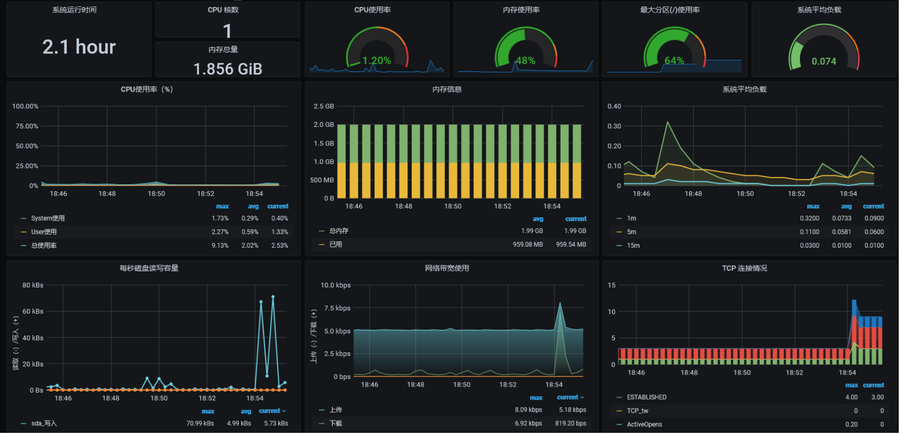

# 普罗米修斯基本操作配置指南

## 本地搭建测试环境情况

两台服务器（win10真实机+kali linux虚拟机）

监视端（win10 localhost）     上安装普罗米修斯以收集服务器数据，并使用Grafana图表化展示。

服务器端（虚拟机  192.168.207.137）上安装数据收集器并开放端口以供监视端的普罗米修斯收集


## 简单安装使用步骤

三个软件相互独立，导出器负责收集服务器数据并提供接口，普罗米修斯通过接口收集数据，Grafana通过普罗米修斯读取数据并进行图形化展示。

### 一、普罗米修斯（Prometheus）

 1.普罗米修斯基于go语言开发，因此需要先下载go语言

 2.官网下载对应系统安装包，解压/安装（https://prometheus.io/download/）

 3.修改安装目录下yml配置文件（主要是设置被监控ip）

```yml
scrape_configs:
  # The job name is added as a label `job=<job_name>` to any timeseries scraped from this config.
  - job_name: 'win10'                    //普罗米修斯显示的名字

    # metrics_path defaults to '/metrics'
    # scheme defaults to 'http'.

    static_configs:
    - targets: ['localhost:9182']            //目标地址

  - job_name: 'linux'                        //添加其他服务器
    static_configs:
    - targets: ['192.168.207.137:9100']
```


 3.启动，访问相应网址即可进入普罗米修斯界面（http://localhost:9090    9090是普罗米修斯默认端口）

服务器数据收集正常


异常


### 二、Grafana 

1.官网下载安装/解压（https://grafana.com/grafana/download）

2.启动，localhost:3000访问（端口默认是3000），默认账户admin/admin;

3.在data source里选择Prometheus并设置数据来源（URL里写上普罗米修斯地址   http://localhost:9090）


4.选择要使用的展示图表dashboard，复制JSON文件内容即可。


### 三、导出器（node_exporter）

1.下载安装包在Linux下解压(https://github.com/prometheus/node_exporter/releases)

2.启动node_exporter

3.收集器默认端口9100 （http://ip地址:9100/metrics即可访问收集数据），9100端口启动则配置完成。


### 四、集成到系统

1.在Grafana目录下的sample.ini中（应该在根目录下conf里面）修改(copy 并改成custom.ini)

```ini
[auth.anonymous]
# enable anonymous access
enabled = true                 //改成true以跳过登录

# set to true if you want to allow browsers to render Grafana in a <frame>, <iframe>, <embed> or <object>. default is false.
allow_embedding = true         //改为true才能套进iframe中
```

2.在Grafana设置好的监控页面复制链接到前端iframe跳转即可

（点两次红框再复制链接就去掉上面和左边的边框，或者直接在链接后面加上“&kiosk”）


3.设置系统侧边栏颜色以适配Grafana主题颜色     

```
黑底（dark）的颜色是  rgb(11,12,14) 
白底（light）的是  rgb(247,248,250)。
```

最终效果图

